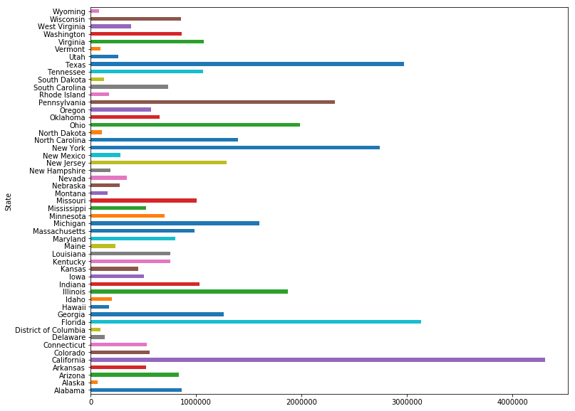
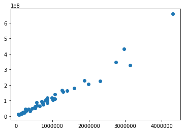
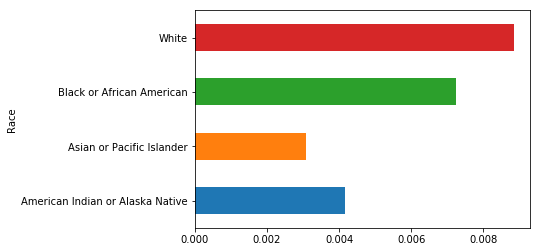

## Ipython Notebook and Running Cells
Ipython/Juptyer notebooks will be our primary tool when conducting data science. The first thing to know with this is that each cell block [of code] can be run be pressing **shift+enter**. Try running the below code block:


```python
print('This is code being run.')
```

## Importing Packages
The next thing we're going to do is load in some python packages that will be part of our toolbox for manipulating and analyzing data. The standard python package for working with data tables is called **pandas** below, we import this under the **alias** pd, which is the industry standard. This will give us a shorthand way to access special functions and methods within the package without having to type the longer name pandas. We also import part of the **matplotlib** package which is used for creating graphs and visualizations. Similarly, the magic command **% matplotlib inline** makes these graphs appear within our jupyter notebook.


```python
import pandas as pd
import matplotlib.pyplot as plt
%matplotlib inline
```

## Loading a DataFrame
The primary datatype within the pandas package is called a dataframe and is similar to a spreadsheet in excel. Here's a brief example of loading a csv file from your hard drive:


```python
df = pd.read_csv('causes_of_death_cleaned.csv')
print(len(df))
df.head(10)
```

    4115


<div>
<style scoped>
    .dataframe tbody tr th:only-of-type {
        vertical-align: middle;
    }

    .dataframe tbody tr th {
        vertical-align: top;
    }

    .dataframe thead th {
        text-align: right;
    }
</style>
<table border="1" class="dataframe">
  <thead>
    <tr style="text-align: right;">
      <th></th>
      <th>Notes</th>
      <th>State</th>
      <th>State Code</th>
      <th>Ten-Year Age Groups</th>
      <th>Ten-Year Age Groups Code</th>
      <th>Gender</th>
      <th>Gender Code</th>
      <th>Race</th>
      <th>Race Code</th>
      <th>Deaths</th>
      <th>Population</th>
      <th>Crude Rate</th>
    </tr>
  </thead>
  <tbody>
    <tr>
      <th>0</th>
      <td>NaN</td>
      <td>Alabama</td>
      <td>1</td>
      <td>&lt; 1 year</td>
      <td>1</td>
      <td>Female</td>
      <td>F</td>
      <td>American Indian or Alaska Native</td>
      <td>1002-5</td>
      <td>14</td>
      <td>3579.0</td>
      <td>Unreliable</td>
    </tr>
    <tr>
      <th>1</th>
      <td>NaN</td>
      <td>Alabama</td>
      <td>1</td>
      <td>&lt; 1 year</td>
      <td>1</td>
      <td>Female</td>
      <td>F</td>
      <td>Asian or Pacific Islander</td>
      <td>A-PI</td>
      <td>24</td>
      <td>7443.0</td>
      <td>322.5</td>
    </tr>
    <tr>
      <th>2</th>
      <td>NaN</td>
      <td>Alabama</td>
      <td>1</td>
      <td>&lt; 1 year</td>
      <td>1</td>
      <td>Female</td>
      <td>F</td>
      <td>Black or African American</td>
      <td>2054-5</td>
      <td>2093</td>
      <td>169339.0</td>
      <td>1236.0</td>
    </tr>
    <tr>
      <th>3</th>
      <td>NaN</td>
      <td>Alabama</td>
      <td>1</td>
      <td>&lt; 1 year</td>
      <td>1</td>
      <td>Female</td>
      <td>F</td>
      <td>White</td>
      <td>2106-3</td>
      <td>2144</td>
      <td>347921.0</td>
      <td>616.2</td>
    </tr>
    <tr>
      <th>4</th>
      <td>NaN</td>
      <td>Alabama</td>
      <td>1</td>
      <td>&lt; 1 year</td>
      <td>1</td>
      <td>Male</td>
      <td>M</td>
      <td>Asian or Pacific Islander</td>
      <td>A-PI</td>
      <td>33</td>
      <td>7366.0</td>
      <td>448.0</td>
    </tr>
    <tr>
      <th>5</th>
      <td>NaN</td>
      <td>Alabama</td>
      <td>1</td>
      <td>&lt; 1 year</td>
      <td>1</td>
      <td>Male</td>
      <td>M</td>
      <td>Black or African American</td>
      <td>2054-5</td>
      <td>2732</td>
      <td>173241.0</td>
      <td>1577.0</td>
    </tr>
    <tr>
      <th>6</th>
      <td>NaN</td>
      <td>Alabama</td>
      <td>1</td>
      <td>&lt; 1 year</td>
      <td>1</td>
      <td>Male</td>
      <td>M</td>
      <td>White</td>
      <td>2106-3</td>
      <td>2788</td>
      <td>364029.0</td>
      <td>765.9</td>
    </tr>
    <tr>
      <th>7</th>
      <td>NaN</td>
      <td>Alabama</td>
      <td>1</td>
      <td>1-4 years</td>
      <td>1-4</td>
      <td>Female</td>
      <td>F</td>
      <td>Asian or Pacific Islander</td>
      <td>A-PI</td>
      <td>10</td>
      <td>30421.0</td>
      <td>Unreliable</td>
    </tr>
    <tr>
      <th>8</th>
      <td>NaN</td>
      <td>Alabama</td>
      <td>1</td>
      <td>1-4 years</td>
      <td>1-4</td>
      <td>Female</td>
      <td>F</td>
      <td>Black or African American</td>
      <td>2054-5</td>
      <td>292</td>
      <td>670420.0</td>
      <td>43.6</td>
    </tr>
    <tr>
      <th>9</th>
      <td>NaN</td>
      <td>Alabama</td>
      <td>1</td>
      <td>1-4 years</td>
      <td>1-4</td>
      <td>Female</td>
      <td>F</td>
      <td>White</td>
      <td>2106-3</td>
      <td>385</td>
      <td>1389699.0</td>
      <td>27.7</td>
    </tr>
  </tbody>
</table>
</div>


## Grouping with Groupby
To group by a feature (or multiple features) use the groupby method.  
Call it by using dot notation on your DataFrame.   
For example df.groupby(feature)  
   
Afterwards, provide an aggregation function for how you want the roll up to happen.
Commonly, we use the sum method:   
df.groupby(feature).sum()


```python
df.groupby('State').sum().head() #Use the head method to limit preview
```


<div>
<style scoped>
    .dataframe tbody tr th:only-of-type {
        vertical-align: middle;
    }

    .dataframe tbody tr th {
        vertical-align: top;
    }

    .dataframe thead th {
        text-align: right;
    }
</style>
<table border="1" class="dataframe">
  <thead>
    <tr style="text-align: right;">
      <th></th>
      <th>Notes</th>
      <th>State Code</th>
      <th>Deaths</th>
      <th>Population</th>
    </tr>
    <tr>
      <th>State</th>
      <th></th>
      <th></th>
      <th></th>
      <th></th>
    </tr>
  </thead>
  <tbody>
    <tr>
      <th>Alabama</th>
      <td>0.0</td>
      <td>81</td>
      <td>860780</td>
      <td>83746349.0</td>
    </tr>
    <tr>
      <th>Alaska</th>
      <td>0.0</td>
      <td>164</td>
      <td>63334</td>
      <td>12140925.0</td>
    </tr>
    <tr>
      <th>Arizona</th>
      <td>0.0</td>
      <td>368</td>
      <td>838094</td>
      <td>109191391.0</td>
    </tr>
    <tr>
      <th>Arkansas</th>
      <td>0.0</td>
      <td>405</td>
      <td>522914</td>
      <td>50938331.0</td>
    </tr>
    <tr>
      <th>California</th>
      <td>0.0</td>
      <td>564</td>
      <td>4307061</td>
      <td>657732064.0</td>
    </tr>
  </tbody>
</table>
</div>


#### Often we also want to use the .reset_index() method. We'll investigate the need for this more later on.


```python
grouped = df.groupby('State').sum().reset_index()
grouped.head() #Use the head method to limit preview
```


<div>
<style scoped>
    .dataframe tbody tr th:only-of-type {
        vertical-align: middle;
    }

    .dataframe tbody tr th {
        vertical-align: top;
    }

    .dataframe thead th {
        text-align: right;
    }
</style>
<table border="1" class="dataframe">
  <thead>
    <tr style="text-align: right;">
      <th></th>
      <th>State</th>
      <th>Notes</th>
      <th>State Code</th>
      <th>Deaths</th>
      <th>Population</th>
    </tr>
  </thead>
  <tbody>
    <tr>
      <th>0</th>
      <td>Alabama</td>
      <td>0.0</td>
      <td>81</td>
      <td>860780</td>
      <td>83746349.0</td>
    </tr>
    <tr>
      <th>1</th>
      <td>Alaska</td>
      <td>0.0</td>
      <td>164</td>
      <td>63334</td>
      <td>12140925.0</td>
    </tr>
    <tr>
      <th>2</th>
      <td>Arizona</td>
      <td>0.0</td>
      <td>368</td>
      <td>838094</td>
      <td>109191391.0</td>
    </tr>
    <tr>
      <th>3</th>
      <td>Arkansas</td>
      <td>0.0</td>
      <td>405</td>
      <td>522914</td>
      <td>50938331.0</td>
    </tr>
    <tr>
      <th>4</th>
      <td>California</td>
      <td>0.0</td>
      <td>564</td>
      <td>4307061</td>
      <td>657732064.0</td>
    </tr>
  </tbody>
</table>
</div>


## We can then plot a specific feature:


```python
grouped.set_index('State')['Deaths'].plot(kind='barh', figsize=(12,10))
```


    <matplotlib.axes._subplots.AxesSubplot at 0x11a69b940>





### 1. Create a bar chart of deaths by Race.
### 2. Create a bar chart of deaths by Gender.
### 3. Create a bar chart of population by Race.
### 4. Create a bar chart of population by State.

### We could also investigate if death and population are related with a scatter plot:


```python
plt.scatter(grouped['Deaths'],grouped['Population'])
```


    <matplotlib.collections.PathCollection at 0x11a9506a0>





Yep, they're pretty darn correlated all right.

### Creating Additional Features
Ok, so we can plot deaths or population by some other feature. What if we want to examine how death rates are related to population by some other feature, such as race? Perhaps we think that there could be some variance there.
Start by first creating a group view, and then create an additional feature.


```python
grouped = df.groupby('Race').sum()
grouped.head(2)
```


<div>
<style scoped>
    .dataframe tbody tr th:only-of-type {
        vertical-align: middle;
    }

    .dataframe tbody tr th {
        vertical-align: top;
    }

    .dataframe thead th {
        text-align: right;
    }
</style>
<table border="1" class="dataframe">
  <thead>
    <tr style="text-align: right;">
      <th></th>
      <th>Notes</th>
      <th>State Code</th>
      <th>Deaths</th>
      <th>Population</th>
    </tr>
    <tr>
      <th>Race</th>
      <th></th>
      <th></th>
      <th></th>
      <th></th>
    </tr>
  </thead>
  <tbody>
    <tr>
      <th>American Indian or Alaska Native</th>
      <td>0.0</td>
      <td>25694</td>
      <td>266319</td>
      <td>64074121.0</td>
    </tr>
    <tr>
      <th>Asian or Pacific Islander</th>
      <td>0.0</td>
      <td>27756</td>
      <td>873266</td>
      <td>282064075.0</td>
    </tr>
  </tbody>
</table>
</div>


Then create an additional column examining the relation between population and deaths.


```python
grouped['Death_Rate'] = grouped.Deaths/grouped.Population
grouped.head(2)
```


<div>
<style scoped>
    .dataframe tbody tr th:only-of-type {
        vertical-align: middle;
    }

    .dataframe tbody tr th {
        vertical-align: top;
    }

    .dataframe thead th {
        text-align: right;
    }
</style>
<table border="1" class="dataframe">
  <thead>
    <tr style="text-align: right;">
      <th></th>
      <th>Notes</th>
      <th>State Code</th>
      <th>Deaths</th>
      <th>Population</th>
      <th>Death_Rate</th>
    </tr>
    <tr>
      <th>Race</th>
      <th></th>
      <th></th>
      <th></th>
      <th></th>
      <th></th>
    </tr>
  </thead>
  <tbody>
    <tr>
      <th>American Indian or Alaska Native</th>
      <td>0.0</td>
      <td>25694</td>
      <td>266319</td>
      <td>64074121.0</td>
      <td>0.004156</td>
    </tr>
    <tr>
      <th>Asian or Pacific Islander</th>
      <td>0.0</td>
      <td>27756</td>
      <td>873266</td>
      <td>282064075.0</td>
      <td>0.003096</td>
    </tr>
  </tbody>
</table>
</div>


```python
grouped.Death_Rate.plot(kind='barh')
```


    <matplotlib.axes._subplots.AxesSubplot at 0x11aa6cfd0>





## We can also groupby multiple features.


```python
grouped = df.groupby(['State', 'Race']).sum()
grouped.head()
```


<div>
<style scoped>
    .dataframe tbody tr th:only-of-type {
        vertical-align: middle;
    }

    .dataframe tbody tr th {
        vertical-align: top;
    }

    .dataframe thead th {
        text-align: right;
    }
</style>
<table border="1" class="dataframe">
  <thead>
    <tr style="text-align: right;">
      <th></th>
      <th></th>
      <th>Notes</th>
      <th>State Code</th>
      <th>Deaths</th>
      <th>Population</th>
    </tr>
    <tr>
      <th>State</th>
      <th>Race</th>
      <th></th>
      <th></th>
      <th></th>
      <th></th>
    </tr>
  </thead>
  <tbody>
    <tr>
      <th rowspan="4" valign="top">Alabama</th>
      <th>American Indian or Alaska Native</th>
      <td>0.0</td>
      <td>16</td>
      <td>1258</td>
      <td>410369.0</td>
    </tr>
    <tr>
      <th>Asian or Pacific Islander</th>
      <td>0.0</td>
      <td>20</td>
      <td>1739</td>
      <td>921001.0</td>
    </tr>
    <tr>
      <th>Black or African American</th>
      <td>0.0</td>
      <td>22</td>
      <td>202092</td>
      <td>22450567.0</td>
    </tr>
    <tr>
      <th>White</th>
      <td>0.0</td>
      <td>23</td>
      <td>655691</td>
      <td>59964412.0</td>
    </tr>
    <tr>
      <th>Alaska</th>
      <th>American Indian or Alaska Native</th>
      <td>0.0</td>
      <td>44</td>
      <td>14698</td>
      <td>2100685.0</td>
    </tr>
  </tbody>
</table>
</div>


Notice that here we had to pass a list of column names to the groupby function.
Also notice the resulting DataFrame; each row is a unique combination of the groupby features we provided. In this case, we will get rows for each State/Race combination possible.


```python
plt.scatter(grouped.Deaths, grouped.Population)
```


    <matplotlib.collections.PathCollection at 0x11ac5f550>


You can also apply different functions:


```python
grouped = df.groupby(['State', 'Race']).mean()
grouped.head()
```


<div>
<style scoped>
    .dataframe tbody tr th:only-of-type {
        vertical-align: middle;
    }

    .dataframe tbody tr th {
        vertical-align: top;
    }

    .dataframe thead th {
        text-align: right;
    }
</style>
<table border="1" class="dataframe">
  <thead>
    <tr style="text-align: right;">
      <th></th>
      <th></th>
      <th>Notes</th>
      <th>State Code</th>
      <th>Deaths</th>
      <th>Population</th>
    </tr>
    <tr>
      <th>State</th>
      <th>Race</th>
      <th></th>
      <th></th>
      <th></th>
      <th></th>
    </tr>
  </thead>
  <tbody>
    <tr>
      <th rowspan="4" valign="top">Alabama</th>
      <th>American Indian or Alaska Native</th>
      <td>NaN</td>
      <td>1.0</td>
      <td>78.625000</td>
      <td>2.564806e+04</td>
    </tr>
    <tr>
      <th>Asian or Pacific Islander</th>
      <td>NaN</td>
      <td>1.0</td>
      <td>86.950000</td>
      <td>4.605005e+04</td>
    </tr>
    <tr>
      <th>Black or African American</th>
      <td>NaN</td>
      <td>1.0</td>
      <td>9186.000000</td>
      <td>1.020480e+06</td>
    </tr>
    <tr>
      <th>White</th>
      <td>NaN</td>
      <td>1.0</td>
      <td>28508.304348</td>
      <td>2.607148e+06</td>
    </tr>
    <tr>
      <th>Alaska</th>
      <th>American Indian or Alaska Native</th>
      <td>NaN</td>
      <td>2.0</td>
      <td>668.090909</td>
      <td>9.548568e+04</td>
    </tr>
  </tbody>
</table>
</div>


```python
grouped = df.groupby(['State', 'Race']).median()
grouped.head()
```


<div>
<style scoped>
    .dataframe tbody tr th:only-of-type {
        vertical-align: middle;
    }

    .dataframe tbody tr th {
        vertical-align: top;
    }

    .dataframe thead th {
        text-align: right;
    }
</style>
<table border="1" class="dataframe">
  <thead>
    <tr style="text-align: right;">
      <th></th>
      <th></th>
      <th>Notes</th>
      <th>State Code</th>
      <th>Deaths</th>
      <th>Population</th>
    </tr>
    <tr>
      <th>State</th>
      <th>Race</th>
      <th></th>
      <th></th>
      <th></th>
      <th></th>
    </tr>
  </thead>
  <tbody>
    <tr>
      <th rowspan="4" valign="top">Alabama</th>
      <th>American Indian or Alaska Native</th>
      <td>NaN</td>
      <td>1.0</td>
      <td>80.0</td>
      <td>30349.0</td>
    </tr>
    <tr>
      <th>Asian or Pacific Islander</th>
      <td>NaN</td>
      <td>1.0</td>
      <td>74.5</td>
      <td>41395.5</td>
    </tr>
    <tr>
      <th>Black or African American</th>
      <td>NaN</td>
      <td>1.0</td>
      <td>5415.5</td>
      <td>1065362.0</td>
    </tr>
    <tr>
      <th>White</th>
      <td>NaN</td>
      <td>1.0</td>
      <td>7900.0</td>
      <td>3600218.0</td>
    </tr>
    <tr>
      <th>Alaska</th>
      <th>American Indian or Alaska Native</th>
      <td>NaN</td>
      <td>2.0</td>
      <td>648.5</td>
      <td>85133.0</td>
    </tr>
  </tbody>
</table>
</div>


## Exercises
1. Groupby State and Gender. Sum the values.
2. Groupby State and Gender and Race. Find the average values.
3. Groupby Gender and Race. Find the minimum values.
